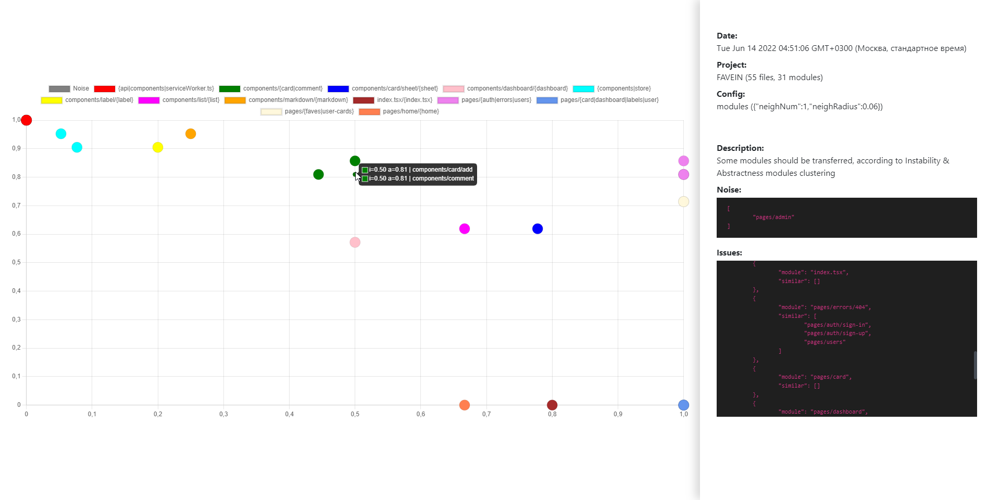

# [🍰 archpolisher](https://www.npmjs.com/package/archpolisher)

> `WIP:` At the moment at work  - **use carefully**
>
> <sup>(C) KPFU ITIS diploma work 2022</sup>

**Architecture analyze toolkit**

- calculate architectural metrics (Instability & Abstractness)
- clusterize modules and search architectural issues
- provides interactive UI with issues details



## Get Started

1. Install toolkit as dev-dependency

    ```sh
    $ npm install -D archpolisher
    # or by yarn
    $ yarn add -D archpolisher
    ```

2. Setup user config `.archpolisherrc`

    ```js
    {
        /** Analysis strategy: by modules | files */
        "strategy": "files",
        /** Analysis options (files filter, module graph rollout depth) */
        "analyzer": {
            "extensions": ["tsx", "ts", "jsx", "js"],
            "abstractnessDepth": 3
        },
        /** Clustering options (neares neighbours num and neighbours nums) */
        "clustering": {
            "neighNum": 1,
            "neighRadius": 0.05
        }
    }
    ```

3. Run toolkit

    ```sh
    $ npm run archpolisher
    # or by yarn
    $ yarn archpolisher
    ```

<!-- 
## Roadmap

WIP...

## See also

WIP... -->
